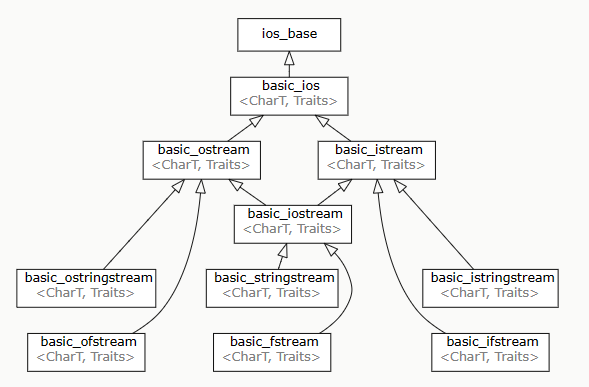
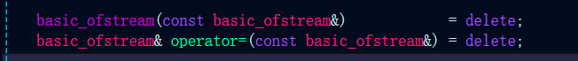
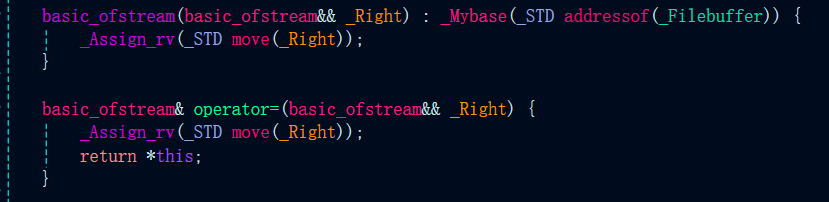
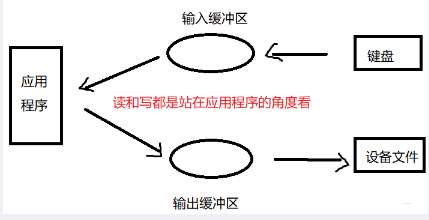
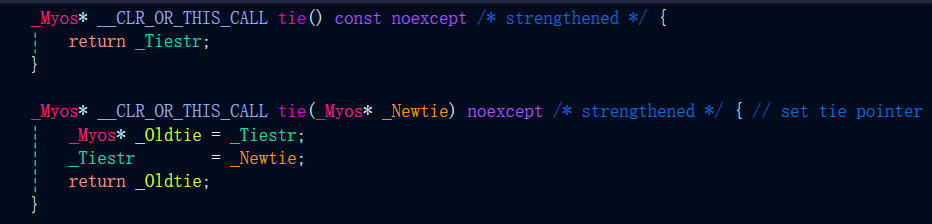

# 8、IO类
## 8.1、 IO类
### 8.1.1、 IO类型间的关系

|头文件|类型|模板参数类型(charT)|类型别名|作用|
|:----|:----|:----|:----|:----|
|iostream|basic_istream<charT, char_traits\<charT>>|char, wchar_t|istream, iwstream|从流中读数据|
|iostream|basic_ostream<charT, char_traits\<charT>>|char, wchar_t|ostream,owstream|往流中写数据|
|iostream|basic_iostream<charT, char_traits\<charT>>|char, wchar_t|iostream,wiostream|读写流|
|fstream|basic_ifstream<charT, char_traits\<charT>>|char, wchar_t|ifstream,wifstream|从文件读数据|
|fstream|basic_ofstream<charT, char_traits\<charT>>|char, wchar_t|ofstream,wofstream|往文件写数据|
|fstream|basic_fstream<charT, char_traits\<charT>>|char, wchar_t|fstream,wfstream|读写文件|
|sstream|basic_istringstream<charT, char_traits\<charT>>|char, wchar_t|istringstream,wistringstream|从string读取数据|
|sstream|basic_ostringstream<charT, char_traits\<charT>>|char, wchar_t|ostringstream,wostringstream|往string写数据|
|sstream|basic_stringstream<charT, char_traits\<charT>>|char, wchar_t|stringstream,wstringstream|读写string|

- IO对象禁用拷贝构造和拷贝赋值，但可以使用移动语义
> 以ofstream类为例 

禁用拷贝构造和赋值运算符重载 

定义了移动语义 

### 8.1.2、 条件状态

>流对象在读或写的时候会记录一些状态来表示当前流是否工作正常

|条件状态|类型|状态值|状态含义|
|:----|:----|:----|:----|
|std::ios::badbit|std::ios::iostate(int)|0x4(100b)|指出流已崩溃，发生不可恢复的读写错误，badbit置位后流不在可用|
|std::ios::failbit|std::ios::iostate(int)|0x2(010b)|指出一个IO操作失败了，可恢复的读写错误，可以继续使用流|
|std::ios::eofbit|std::ios::iostate(int)|0x1(001b)|指出流达到了文件结束(EOF)，读到文件结尾(eofbit和failbit都会被置为1)|
|std::ios::goodbit|std::ios::iostate(int)|0x0(000b)|指出流正常工作|

> 查询流对象当前的条件状态

|函数名|作用|
|:----|:----|
|s.eof()|如果流s的eofbit置为1，返回true|
|s.fail()|如果流s的failbit置为1，返回true|
|s.bad()|如果流s的badbit置为1，返回true|
|s.good()|如果流s的所有条件状态bit都为0，返回true|

> 管理流对象的条件状态

|函数名|作用|
|:----|:----|
|s.clear()|将流s的条件状态置为goodbit，返回void|
|s.clear(flags)|将给定的条件状态bit置位0，返回void|
|s.setstate(flags)|将给定的条件状态bit设为1，返回void|
|s.rdstate()|返回当前流s的条件状态|

### 8.1.3、 管理输出缓冲

> 每个输出流都有一个缓冲区，缓冲区类型
- 全缓冲：缓冲区被写满才进行实际I/O，典型用法时磁盘文件的读写
- 行缓冲：碰到换行符才执行I/O操作，典型用法是cin读取键盘的输入
- 不缓冲：比如cerr，直接打印信息到控制台，不做缓存

> 导致输出缓冲区刷新的行为
- 程序正常结束
- 缓冲区满
- 手动刷新(std::endl, std::flush, std::ends)
    - endl: 换行并刷新缓冲区
    - ends: 插入空字符，然后刷新缓冲区
    - flush: 直接刷新缓冲区

- 使用unitbuf和notunitbuf操纵符(manipulator)控制是否将数据进行缓冲
    - cerr默认设置unitbuf
    - std::cout << std::unitbuf; 之后的cout输出都不再做缓冲
    - std::cout << std::notunitbuf; 之后的cout输出恢复缓冲
- 流a关联一个输出流b，当对流a进行读写时，会刷新流a的缓冲区
    - cerr 和 cin都默认关联了cout， 当写cerr或读cin都会导致cout刷新缓冲区

> 注意: 当程序异常结束的时候，输出缓冲还未刷新，会导致一些字符没做I/O操作的错误

> tie函数:关联输入和输出流

tie函数定义在basic_ios类中，有两个重载
|函数原型|描述|
|:----|:----|
|basic_ostream* basic_ios::tie()|返回当前流绑定的输出流指针|
|basic_ostream* basic_ios::tie(basic_ostream*)|当前流绑定一个新的输出流，返回之前绑定的输出流指针|

