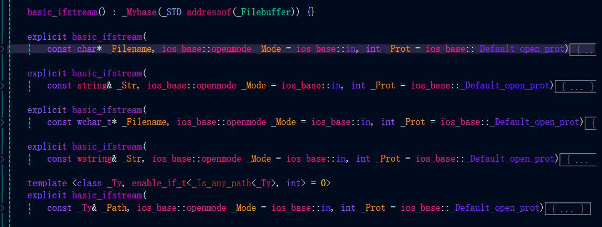
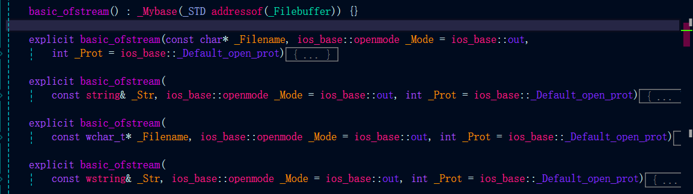
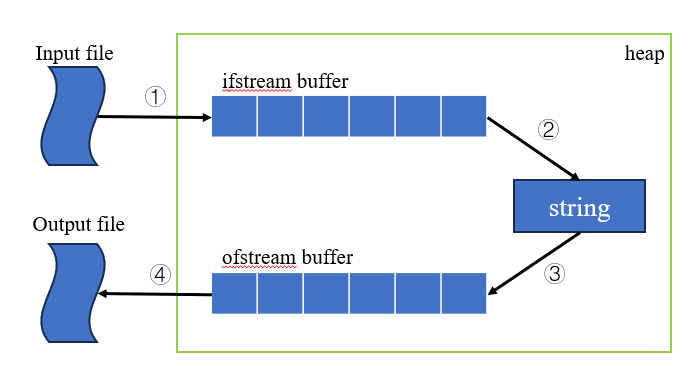

# 8.2、 文件的输入输出

## 8.2.1、文件流对象

> 文件输入流类部分构造函数

> 文件输出流类部分构造函数

> 流对象文件的绑定和解绑
- open函数和close函数
    - 当前流对象s没有绑定文件时通过s.open(file, mode=default_mode)绑定文件
    - 当前流对象s已经绑定了文件，需要先s.close()，再调用open绑定新文件

- 流对象的构造和析构
    - 流对象在构造的时候可以选择绑定或不绑定文件
    - 如果流对象在析构时还绑定着文件，析构函数会调用close进行解绑

## 8.2.2、 文件的打开模式

|适用的流类型|文件模式|值|说明|
|:----|:----|:----|:----|
|ifstream|std::ios::in|0x01|以读方式绑定文件|
|ofstream|std::ios::out|0x02|以写方式绑定文件，默认打开会截断文件|
|ofstream|std::ios::app|0x08|以追加内容方式绑定文件|
|ofstream|std::ios::truc|0x10|截断文件|
|ifstream/ofstream|std::ate|0x04|打开文件后定位在文件末尾|
|ifstream/ofstream|std::binary|0x20|以二进制方式进行I\O|

## 8.2.3 文件的读写

- ① 文件绑定到文件输入流
    - 初始化时绑定文件（有参构造）
    - open函数绑定文件
- ② 文件输入流到内存数据结构
    - getline函数
    - read函数
- ③ 内存空间到文件输出流
    - 内置类型或类库中的类型（比如stl容器）可以直接输出到文件输出流
    - 自定义类型需要重载 << 运算符
- ④ 文件输出流到输出文件
   - 初始化时绑定文件（有参构造）
    - open函数绑定文件

> getline, read函数
