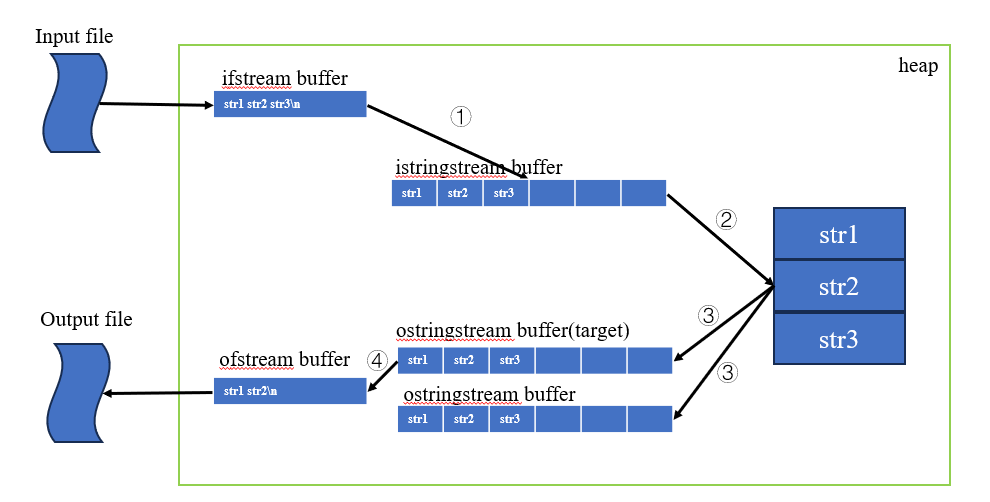

# 8.3、 string流

##  8.3.1、istringstream和ostringstream
istringstream向string写入数据，ostringstream从string中读取数据

>常用操作

|头文件|类型|操作|说明|
|:----|:----|:----|:----|
|sstream|istringstream|istringstream()|初始化string输入流对象，不绑定string|
|sstream|istringstream|istringstream(const std:string&)|初始化string输入流对象，不绑定string|
|sstream|ostringstream|ostringstream()|初始化string输出流对象，不绑定string|
|sstream|ostringstream|ostringstream(const std:string&)|初始化string输出流对象，不绑定string|
|sstream|istringstream/ostringstream|ss.str()|返回当前字符串流对象中存储的字符串拷贝|
|sstream|istringstream/ostringstream|ss.str(s)|将string拷贝到流对象中，返回void|

## 8.3.2、 使用流对象

- ① 从ifstream中getline获得string对象，并将该string记录到流对象中
    - 有参构造，绑定string对象
    - ss.str(const string&)绑定string
- ② 字符串从输入字符流流向string
    - 类似于cin，输入流字符串在流向字符串时，以空格方式进行分割
- ③ 内存空间到字符输出流
    - 将内存中的字符串对象进行变换或检查后，符合要求的字符串存在输出字符串流对象(target),不符合要求的放在另一个输出流对象里
- ④ 输出流对象(target)字符串流向文件输出流
   - 通过ss.str()函数将输出流对象的字符取出来插入到文件输出流