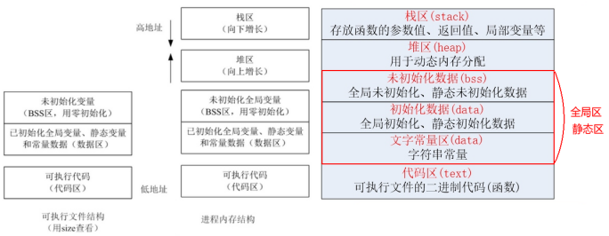

## c++程序的内存模型
除动态分配对象外,c++程序使用的对象都有着严格定义的声明周期

|对象|作用域|生命周期|存储位置|
|:----|:----|:----|:----|
|局部变量|{}内|进入作用域分配，离开作用域销毁|栈区(stack)|
|static局部变量|全局|第一次使用时分配，程序结束时销毁|未初始化在.bss段，初始化在.data段|
|extern变量|全局|程序启动时分配，程序结束时销毁|未初始化在.bss段，初始化在.data段|
|static全局变量|全局|程序启动时分配，程序结束时销毁|未初始化在.bss段，初始化在.data段|
|extern函数|全局|程序运行期间均可调用|代码区(text)|
|static函数|当前文件|程序运行期间仅本文件内可调用|代码区(text)|
|register变量|{}内|当前函数|CPU寄存器|
|字符串常量|当前文件|第一次使用时分配，程序结束时销毁|文字常量区(data)|
|动态分配对象|手动控制|手动申请时分配，手动释放后销毁|堆区(heap)|

本章将认识动态分配对象，动态分配对象的生命周期是手动管理的，需要手动申请内存和释放内存，使用不当将会引起内存泄漏，指针悬空等问题。 
为了更安全的使用动态分配对象，c++标准库提供了智能指针来管理它。智能指针是泛化的指针，使用RAII（Resource Aquarian As Initialization）技术在构造时初始化指针，在析构时释放内存。

## 动态内存和智能指针
### 1、 动态内存管理
动态内存通过<strong>new</strong>来为对象申请空间并返回一个指向该对象的指针
   
    Complex* pc = new Complex(1, 2);

    // 上面的new语句可解释为以下操作
    {
        void* mem = operator new(sizeof(Complex));  // ① 分配内存（内存调用malloc）
        pc = static_cast<Complex*>(mem);            // ② 类型转换
        pc->Complex::Complex(1,2);                  // ③ 构造函数初始化
    }

通过<strong>delete</strong>来为释放对象资源
    
    delete pc;

    // 上面的delete语句可解释为以下操作
    {
        pc->Complex::~Complex();                    // ① 调用析构函数
        operator delete(pc);                        // ② 回收内存(内部调用free)
    }

### 2、动态内存常见的问题
- 内存泄漏： 手动申请内存后忘记释放
- 指针悬空： 释放内存之后仍有指针指向该内存（会产生引用非法内存的指针）

## shared_ptr类
shared_ptr类内有一个引用计数用来存储有多少个shared_ptr引用了同一个资源，当引用技术的值为0时，shared_ptr类将自动释放资源。

|操作|支持的智能指针|描述|
|:----|:----|:----|
|shared_ptr\<T> sp   unique_ptr\<T> up|shared_ptr unique_ptr |可指向T类型的空智能指针|
|p|shared_ptr unique_ptr|将p用作条件判断，p指向一个对象，则为true|
|*p|shared_ptr unique_ptr|解引用|
|p.get()|shared_ptr unique_ptr|获取智能指针中保存的裸指针|
|swap(p, q)|shared_ptr unique_ptr|交换p和q的指针|
|p.swap(q)|shared_ptr unique_ptr|交换p和q的指针|
|make_shared<T>(args)|shared_ptr|使用args初始化一个资源，并返回一个shared_ptr|
|make_unique(args)|unique_ptr|使用args初始化一个资源，并返回一个shared_ptr|
|shared_ptr<T>p(q)|shared_ptr|拷贝构造，引用计数+1|
|p = q|shared_ptr|拷贝赋值，引用计数+1|
|p.unique()|shared_ptr|p的引用计数为1返回true，否则false|
|p.use_count()|shared_ptr|返回p的引用计数|

