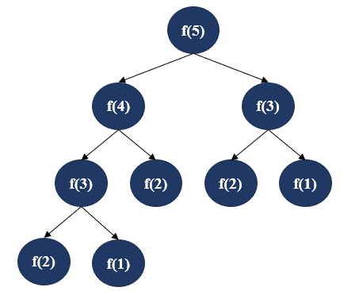
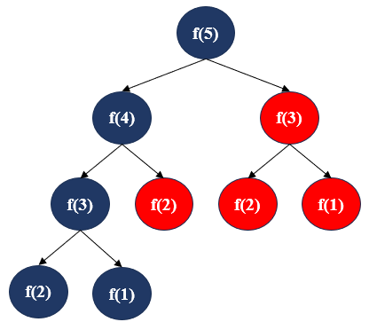
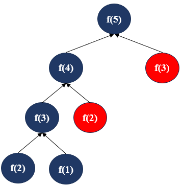

# 01_从记忆化搜索到递推

## 1.1 动态规划的基本思想

动态规划是一种通过把原问题分解为相对简单的子问题的方式求解复杂问题的方法。

## 1.2 从记忆化递归到递推的具体推导

从问题[leetcode 198. 打家劫舍](https://leetcode.cn/problems/house-robber/description/?envType=study-plan-v2&envId=dynamic-programming)开始谈起 

### 1.2.1 递归搜索

对于`N`个价值分别为`[2,7,9,3,1]`房子的问题求解，分两种情况

- 1. 偷第`N`个房子
- 2. 不偷第`N`个房子

基于动态规划的思想，将剩余`N-1`个房子看作一个子问题 
那么对于第一种情况则有

$$
    f(N) = f(N-1)
$$

对于第二种情况则有

$$
    f(N) = f(N-2) + value(N)
$$

那么已经偷了`N`个价值分别为`[2,7,9,3,1]`房子的最大价值就可以表示为

$$
    f(N) = max(f(N-1), f(N-2) + value(N))
$$

其中 $f(x),1<=x<=N$ 表示已经偷的前`x`个房子的最大价值。$value(i), 1<=i<=N$ 表示第`i`个房子的价值。

由上面的分析可以看出，对于求解 $f(N)$ 这个问题，可以看作求解它的子问题 $f(N-1)$ 和 $f(N-2)$ ，这样一步一步拆分下去就能到达一个最小子问题$f(1)$和$f(2)$,状态空间如下

[递归搜索求解cpp代码](../../../code/algorithm/动态规划/01.cpp)

### 1.2.2 记忆化搜索

从上面的图中可以看到有很多结点会被重复计算，因此可以引入一个数组或哈希表记录这些值，避免重复计算。

[记忆化搜索cpp求解代码](../../../code/algorithm/动态规划/01.cpp)

### 1.2.3 递推

通过递归的方式可以看到，类似于斐波那契数列，问题的求解依赖于子问题的求解，那么换种思路，先求解子问题，然后再一步一步递推得到问题的解可不可以呢？

对于`N`个价值分别为`[2,7,9,3,1]`房子的问题求解，可以得到最小的子问题解如下

$$
    f(1) = 2
$$

$$
    f(2) = max(2, 7) = 7
$$

而对于问题规模为 $i,(1<=i<=N)$ 的子问题,可以得出以下递推公式

$$
    f(i) = max(f(i-1), f(i - 2) + value(i))
$$

[递推cpp代码](../../../code/algorithm/动态规划/01.cpp)