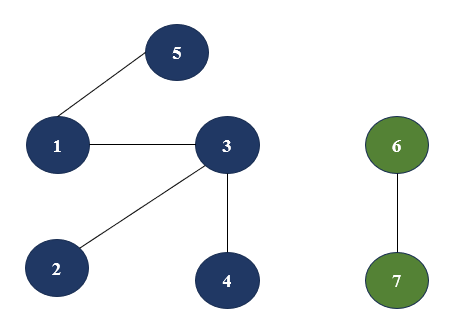
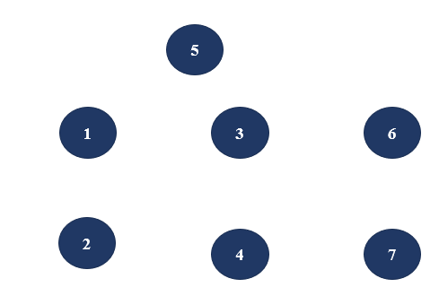
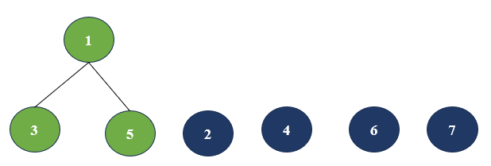
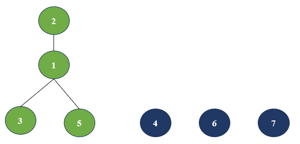
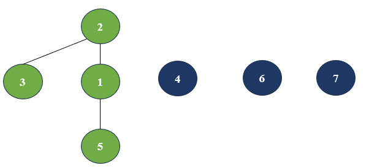
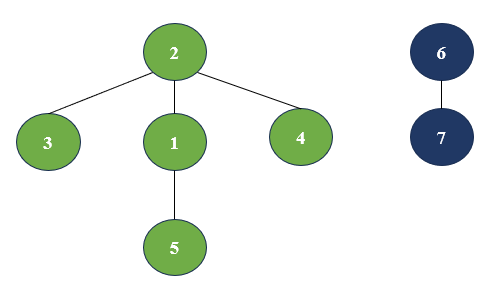

# 01_并查集(Disjoint Set Unoin)

什么是并查集? 并查集适合解决什么样的问题？<br/>
首先描述一下并查集的概念。
>并查集是一种用于管理元素所属集合的数据结构，实现为一个森林，其中每棵树表示一个集合，树中的节点表示对应集合中的元素。<br/>

其次从数据结构的角度来描述并查集。 从逻辑结构来看它是树形结构，是一个一对多的结构。从物理结构来看，经常使用数组来存储并查集元素，是一个线性物理结构。<br/>

使用一个具体例子来描述并查集
> 某个学校新生开学，现在有3个学生班，每个班有若干个学生和一个班主任，对于任意一个学生，他们的共同特点是都有一个班主任。任意某两个学生可以通过互相确定自己的班主任是不是一样来确定他们是不是一个班的。抽象来看，将班级看作三棵树，每个学生看作一个结点，而班主任是根节点，这样两个树之间任意结点之间的关系就可以看作他们的根结点的关系

## 1.1 并查集的数据结构

首先明确并查集要有的功能

- 找到元素的代表元素
- 将一个集合合并入另一个集合

并查集数据结构描述如下

```cpp
    struct DSU{
        // 存储并查集元素的数组
        // 下标代表元素编号，下标对应存储值表示该元素的根元素（树的根结点）
        vector<int> parents;
    };
    // 查找结点x和根元素
    int FindParentDSU(DSU &dsu, int x);

    // 将y结点所在集合合并入x结点所在集合中
    int UnionDSU(DSU &dsu, int x, int y);
```

## 1.2 从一个具体例子开始

基于问题[leetcode 547. 省份数量](https://leetcode.cn/problems/number-of-provinces/description/)对并查集的应用

假设有以下城市群



遍历整个图获取整个图的连通分量数固然可以，但是比较麻烦。<br/>
显然如果构造一个并查集，只需要查找有多少个根节点既可解决该问题。<br/>

下面来模拟并查集构建过程<br/>

1、初始化并查集



2、遍历所有跟元素1有关系的边



3、遍历所有跟元素2有关系的边<br/>
这里比较特殊，元素2是跟元素3相连时执行的操作是将元素3的集合合并到元素2的下面，即将元素3的根结点元素1的根节点设为元素2



4、遍历所有跟元素3有关系的边

由于此时元素3的根不能直接找到，所以先找元素3的根，并在找的过程中更新沿途所有元素的根



找的过程结束后，将元素4加入元素3所在集合


5、 遍历所有跟元素4有关系的边（没有变化，跟元素3一样）

6、 遍历所有跟元素5有关系的边 (没有变化，跟元素3一样)

7、 遍历所有跟元素6有关系的边



8、 遍历所有跟元素7有关系的边 (没有变化，跟元素6一样)

9、 遍历并查集，得到的根的数量即为问题的解

## 1.2 并查集实现

[并查集cpp代码](../../../code/algorithm/数据结构/01_并查集.cpp)