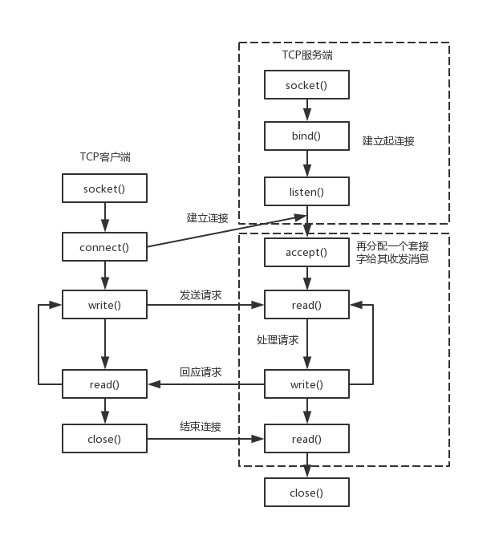
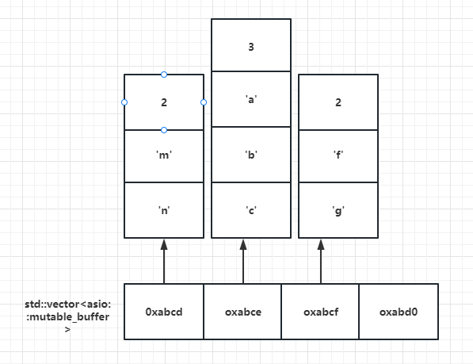

# Charpter 01 Asio基本概念
## 1.1 网络编程的基本流程



图的左侧TCP客户端的流程：
1. `socket()`：创建一个套接字。
2. `connect()`：与服务器建立连接。
3. `write()`：发送请求数据。
4. `read()`：读取响应数据。
5. `close()`：关闭连接。

图的右侧TCP服务器端的流程：
1. `socket()`：创建一个套接字。
2. `bind()`：绑定到特定的端口。
3. `listen()`：监听连接请求。
4. `accept()`：接受客户端的连接请求，并分配一个新的套接字来与客户机进行通信。
5. `read()`：读取客户机的数据。
6. `write()`：处理请求并发送响应数据。
7. `read()`：再次读取数据。
8. `close()`：关闭连接。

在建立连接成功后，客户端通过`write()`发送请求，服务器通过`read()`接收请求并处理，然后通过`write()`发送响应，客户端再通过`read()`接收响应。最后，双方通过`close()`关闭连接。


## 1.2 基于asio网络库的回声服务器端

```cpp
    // server.cpp
    const short port = 8080;
    boost::system::error_code ec;
    char buf[1025];

    // 创建运行的上下文环境
    boost::asio::io_context ioc;
    
    // 创建socket
    boost::asio::ip::tcp::socket sock(ioc);
    
    // 创建监听者
    boost::asio::ip::tcp::acceptor acc(ioc, boost::asio::ip::tcp::endpoint(boost::asio::ip::tcp::v4(), port));
    
    // 注册监听服务
    acc.accept(sock);

    // 读消息
    memset(buf, 0, sizeof(buf));
    std::size_t recv_len;
    std::string recv_message("");

    sock.read_some(boost::asio::buffer(buf, 1024), ec);
    if (!ec)
    {
        recv_message = std::string(buf, 1024);
        std::cout << "read successfully" << std::endl;
        std::cout << recv_message << std::endl;
    }

    // 发送消息
    sock.send(boost::asio::buffer(recv_message));
```

## 1.3 基于asio网络库的回声客户端

```cpp
    const std::string server_addr = "127.0.0.1";
    const short port = 8080;
    char buf[1025];
    
    // 创建运行上下文环境
    boost::asio::io_context ioc;

    // 初始化socket
    boost::asio::ip::tcp::socket sock(ioc);

    // socket绑定到服务器端，与服务器端建立连接
    sock.connect(boost::asio::ip::tcp::endpoint(boost::asio::ip::address::from_string(server_addr), port));
    
    // 构建消息
    Json::Value root;
    root["id"] = 1001;
    root["data"] = "hello server.";
    std::string send_message = root.toStyledString();
    
    // 发送消息
    sock.send(boost::asio::buffer(send_message));
    
    // 接收消息
    memset(buf, 0, sizeof(buf));
    std::size_t recv_len;
    std::string recv_message("");
    recv_len = sock.read_some(boost::asio::buffer(buf, 1024));
    recv_message = std::string(buf, recv_len);
    std::cout << "server say:\n";
    std::cout << recv_message;
```

## 1.4 Asio缓冲区的概念
Asio网络库中常用的发送接收函数要传输的数据结构是一个特殊的结构。如下图所示，asio中的buffer是一个存储了一系列消息（存储了字符串和他的长度）的指针数组


buffer可以分为两类: const_buffer和mutable_buffer，对于接收消息的函数，它所使用的buffer是一个mutable_buffer，而对于发送消息的函数，它所使用的buffer是一个const_buffer。<br/>

通过使用函数`boost::asio::buffer(buf, buf_size)`可以构造一个buffer结构，并根据需要自动转换为mutable_buffer/const_buffer
