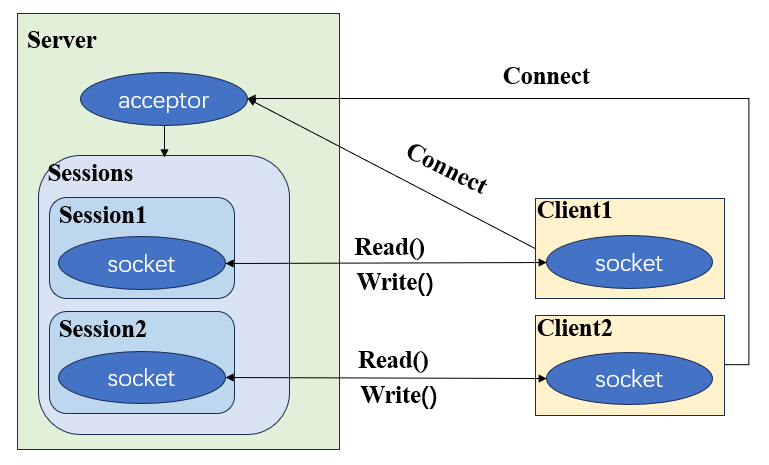

# Charpter 03 同步读写客户端服务器

## 3.1 需求分析
> 要设计一个产品少不了明确产品的功能，同步读写客户端和服务器要具有的功能如下

- 客户端
    - 1、 能连接到服务器
    - 2、 发送消息到服务器
    - 3、 从服务器接收消息

- 服务器端
    - 能接收多个客户端的连接
    - 能和多个客户端同时通信

## 3.2 同步读写网络模型
> 新客户端连接到服务器端时，服务器端的acceptor会接收到连接信息，这时acceptor会初始化一个与客户端通信的socket，服务器端创建一个新线程来单独负责与新到来客户端的通信。




## 3.3 通信的消息结构
> 由于tcp是流式传输，发送端往发送缓冲区写入字节流，接收端从接收缓冲区读出字节流，接收端并不知道自己要读多长。<br/>
> 这样会产生一个tcp粘包问题，发送端想要发送两个消息"hello,world"和"count=1000", 但是接收端读了两次，第一次是"hello,worldcount",第二次是"=1000",接收端无法知道原来的两个包是什么。通过统一两端的消息协议可以解决粘包问题。 


## 3. 4 服务器端的设计

> 服务器端acceptor一旦接收到外部的新连接请求就建立一个session处理与新连接通信的线程

```cpp
    void server(boost::asio::io_context& ioc, short port)
    {
        boost::asio::ip::tcp::endpoint server_endpoint(boost::asio::ip::tcp::v4(), port);
        boost::asio::ip::tcp::acceptor acc(ioc, server_endpoint);
        for (;;)
        {
            std::shared_ptr<boost::asio::ip::tcp::socket> sock = std::make_shared<boost::asio::ip::tcp::socket>(ioc);
            acc.accept(*sock);
            std::shared_ptr<std::thread> t = std::make_shared<std::thread>(session, sock);
            threads.insert(t);
        }
    }
```

> session负责与客户端通信

```cpp
    void session(std::shared_ptr<boost::asio::ip::tcp::socket> sock)
    {
        // 使用try catch捕捉和处理通信的错误，使和一个客户端的通信错误不会影响到整个服务器
        try{
            for (;;)
            {
                // read header
                short message_id{0};
                short message_size{0};
                char buf[4];

                boost::system::error_code ec;
                std::memset(buf, 0, sizeof(buf));
                int read_len = boost::asio::read(*sock, boost::asio::buffer(buf, HEADER_LENGHT), ec);
                if (ec == boost::asio::error::eof)
                {
                    std::cout << "remote closed." << std::endl;
                    sock->close();
                    break;
                }
                
                // message id
                std::memcpy(&message_id, buf, MESSAGE_ID_LENGHT);
                
                // message size
                std::memcpy(&message_size, buf + MESSAGE_ID_LENGHT, MESSAGE_SIZE_LENGHT);
                
                // transfer 
                message_id = boost::asio::detail::socket_ops::network_to_host_short(message_id);
                message_size = boost::asio::detail::socket_ops::network_to_host_short(message_size);

                // read data
                char *data = new char[message_size+1];
                std::memset(data, 0, message_size + 1);
                
                boost::asio::read(*sock, boost::asio::buffer(data, message_size));
                

                printf("received message: %s", data);


                // send data
                Json::Value root;
                root["id"] = message_id;
                root["data"] = "hello client.";
                std::string send_message = root.toStyledString();    
                
                short send_message_size = send_message.size();
                short send_message_id = message_id;
                char* send_data = new char[send_message_size + HEADER_LENGHT + 1];
                std::memset(send_data, 0, send_message_size);

                // transfer
                send_message_size = boost::asio::detail::socket_ops::host_to_network_short(send_message_size);
                send_message_id = boost::asio::detail::socket_ops::host_to_network_short(send_message_id);

                // fill buf
                std::memcpy(send_data, &send_message_id, MESSAGE_ID_LENGHT);
                std::memcpy(send_data + MESSAGE_ID_LENGHT, &send_message_size, MESSAGE_SIZE_LENGHT);
                std::memcpy(send_data + HEADER_LENGHT, send_message.c_str(), send_message.size());
                
                boost::asio::write(*sock, boost::asio::buffer(send_data, send_message.size() + HEADER_LENGHT));


                delete[] data;
                delete[] send_data;
                data = nullptr;
                send_data = nullptr;
            }
            sock->close();
        }catch(std::exception& e)
        {
            std::cerr << "Error. " << e.what() ;
        }
    }

```

## 3.5 客户端

```cpp
    sock.connect(server_end);
    // send
    {
        printf("client send message begin.\n");
        short message_id{0};
        short message_size{0};
        std::string message;
        
        Json::Value root;
        root["id"] = 1001;
        root["data"] = "hello server.";
        
        message = root.toStyledString();
        message_id = root["id"].asInt();
        message_size = message.size();

       
        char * data = new char[message_size + HEADER_LENGHT + 1];
        std::memset(data, 0, message_size + HEADER_LENGHT + 1);
        
        message_id = boost::asio::detail::socket_ops::host_to_network_short(message_id);
        message_size = boost::asio::detail::socket_ops::host_to_network_short(message_size);

        std::memcpy(data, &message_id, MESSAGE_ID_LENGHT); 
        std::memcpy(data + MESSAGE_ID_LENGHT, &message_size, MESSAGE_SIZE_LENGHT);
        std::memcpy(data + HEADER_LENGHT, message.c_str(), message.size());

        boost::asio::write(sock, boost::asio::buffer(data, message.size() + HEADER_LENGHT));
        printf("client send message end.\n");
        delete [] data;
    }

    // read
    {
        printf("client read message begin.\n");
        short recv_message_id{0};
        short recv_message_size{0};
        boost::asio::read(sock, boost::asio::buffer(&recv_message_id, MESSAGE_ID_LENGHT));
        boost::asio::read(sock, boost::asio::buffer(&recv_message_size, MESSAGE_SIZE_LENGHT));
        recv_message_id = boost::asio::detail::socket_ops::network_to_host_short(recv_message_id);
        recv_message_size = boost::asio::detail::socket_ops::network_to_host_short(recv_message_size);
        char *recv_data = new char[recv_message_size+1];
        std::memset(recv_data, 0, recv_message_size + 1);
        boost::asio::read(sock, boost::asio::buffer(recv_data, recv_message_size));

        printf("server say: %s", recv_data);
        printf("client read message end.\n");
        delete[] recv_data;
    }

    sock.close();
```