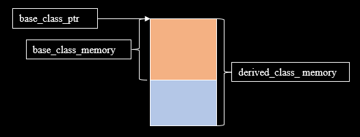

# 7.2 多态

多态是面向对象的重要特性，在C++ Primer Plus中，多态有以下定义

> 多态被定义为一种能够用相同的方式处理不同类型的对象的能力，这通常通过虚函数来实现。

多态的实现方式按函数绑定时期可分为静态多态和动态多态， 其中

- 静态多态: 
    - 函数重载
    - 函数模板

- 动态多态：
    - 虚函数

下面将以一个具体的多态场景来阐述多态不同实现的区别

> 要求实现一个用来画图形的函数，可根据传入的参数画出不同的图形

## 7.2.1 静态多态-函数重载

使用函数重载实现上面多态问题的需求本质上是为每一种需求写一个函数
具体实现代码[polymorphism_overload.cpp](../../../code/cpp_primer/ch_07_虚函数/02_多态/polymorphism_overload.cpp)

## 7.2.2 静态多态-函数模板

使用函数模板实现上面多态问题的需求虽然表面上只写了一个模板函数，但是每当一个没有实例化的模板特化函数被调用，编译器就会生成一个模板特化函数，本质上还是为每个图形需求生成了一个函数。具体实现代码[polymorphism_template.cpp](../../../code/cpp_primer/ch_07_虚函数/02_多态/polymorphism_template.cpp)


## 7.2.3 动态多态-虚函数

能不能只用一个函数就实现需求呢？<br/>
使用虚函数可以做到，动态多态依赖两个机制

- 1、 向上转型
- 2、 虚函数机制


通过函数的继承关系可以知道所有图形类都有一个共同的基类`Shape`

```cpp
class Shape {
public:
    void Draw() {
        std::cout << "Draw Shape." << std::endl;
    }
};

class Line : public Shape {
public:
    void Draw() {
        std::cout << "Draw Line." << std::endl;
    }
};

class Circle : public Shape {
public:
    void Draw() {
        std::cout << "Draw Circle." << std::endl;
    }
};
```

假设设计以下的接口，并且让基类指针指向派生类对象时，通过基类指针可以调用到派生类对象对应的方法。这种做法就是动态多态。

```cpp
void draw(Shape* shape);
```

使用基类指针指向派生类对象的行为叫`向上转型`，由于派生类的内存空间一定大于等于基类的内存空间，所以`向上转型`是内存安全的



通过给基类函数加上`virtual`关键字，编译器看到`virtual`关键字就不再简单的根据对象类型进行函数绑定，而是将绑定推迟到运行阶段，根据虚函数机制找到函数入口地址， 虚函数机制参考文章[虚函数机制.md](./ch07-03-虚函数机制.md)

动态多态的实现代码[polymorphism_dynamic.cpp](../../../code/cpp_primer/ch_07_虚函数/02_多态/polymorphism_dynamic.cpp)

