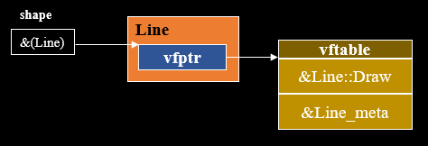

# 7.3 虚函数机制

虚函数机制是实现在运行时动态地将函数调用和函数定义进行关联的机制，编译器会自动给包含虚函数的类的第一个成员位置加上一个指向虚函数表的指针。

虚函数机制主要有两个应用场景

- 动态绑定
- 运行时类型识别(RTTI)

## 7.3.1 虚函数机制与动态绑定

前面说过，应用动态绑定需要两个条件

- 1、 基类指针指向派生类对象
- 2、 使用基类指针调用的函数为虚函数

通过对比看一下虚函数的作用，假设程序只满足`1、 基类指针指向派生类对象`时，由于此时是静态绑定，所以在执行`shape->Draw()`时执行的永远是`Shape::Draw()`

```cpp
class Shape {
public:
    void Draw() {
        std::cout << "Draw Shape." << std::endl;
    }
};

class Line : public Shape {
public:
    void Draw() {
        std::cout << "Draw Line." << std::endl;
    }
};

class Circle : public Shape {
public:
    void Draw() {
        std::cout << "Draw Circle." << std::endl;
    }
};

void draw(Shape* shape)
{
    shape->Draw();
}

int main()
{
    draw(new Line);     // output: Draw Shape.
    draw(new Circle);   // output: Draw Shape.
}
```

如果将`Shape::Draw()`设为虚函数又会发生什么呢? 可以看到根据传入对象的不同`shape->Draw()`产生了不同的行为

```cpp
class Shape {
public:
    // 添加virtual关键字，调用该函数及子类重新函数将在运行时进行动态绑定
    virtual void Draw() {
        std::cout << "Draw Shape." << std::endl;
    }
};

class Line : public Shape {
public:
    void Draw() {
        std::cout << "Draw Line." << std::endl;
    }
};

class Circle : public Shape {
public:
    void Draw() {
        std::cout << "Draw Circle." << std::endl;
    }
};


// 动态绑定通过虚函数机制实现的多态
void draw(Shape* shape)
{
    shape->Draw();
}

int main()
{
    draw(new Line);     // output: Draw Line.
    draw(new Circle);   // output: Draw Circle.
}
```

## 7.3.2 虚函数表

下面将详细阐述虚函数机制

### 7.3.2.1 虚函数表指针和虚函数表初始化

当基类包含由`virtual`关键字修饰的函数时，编译器会自动在基类的第一个成员函数处添加一个`指向虚函数表的指针`，这个指针由该基类的所有对象共享。

对于包含`virtual`关键字修饰函数的基类，他的所有派生类将会继承基类的`指向虚函数表的指针`，并且可以选择重写(override)基类的虚函数。<br/>
如果派生类重写了虚函数，派生类的虚函数表将存储派生类的虚函数地址。如果派生类没有重写虚函数，派生类的虚函数表将仍存放基类的虚函数地址。

此外编译器自动为所有包含`指向虚函数表的指针`的类维护一个虚函数表。该虚函数维护以下信息

- 类的类型信息
- 类的所有虚函数地址

通过使用IDE Visual Studio提供的工具可以得到[dynamic_polymorphism.cpp](../../../code/cpp_primer/ch_07_虚函数/03_虚函数机制/dynamic_polymorphism.cpp) 中定义的各个类的成员信息


```
class Shape     size(4):
        +---
 0      | {vfptr}
        +---

Shape::$vftable@:
        | &Shape_meta
        |  0
 0      | &Shape::Draw

Shape::Draw this adjustor: 0
```

```
class Line      size(4):
        +---
 0      | +--- (base class Shape)
 0      | | {vfptr}
        | +---
        +---

Line::$vftable@:
        | &Line_meta
        |  0
 0      | &Line::Draw

Line::Draw this adjustor: 0
```

```
class Circle    size(4):
        +---
 0      | +--- (base class Shape)
 0      | | {vfptr}
        | +---
        +---

Circle::$vftable@:
        | &Circle_meta
        |  0
 0      | &Circle::Draw

Circle::Draw this adjustor: 0
```

### 7.3.2.2 动态绑定的过程

为了更好的分析这一过程，
[dynamic_polymorphism.cpp](../../../code/cpp_primer/ch_07_虚函数/03_虚函数机制/dynamic_polymorphism.cpp)中画Line的过程可以写成下面这样

```cpp
Line* line = new Line;  // 在堆上申请创建一个Line对象
Shape* shape = line;    // 向上转型
shape->Draw();          // 调用虚函数，
```

其内存示意图如下，由于`shape`是`Shape`类型指针，并且`Shape`类和`Line`类都只包含一个隐藏的成员`vfptr`， 所以指针`shape`可访问的内存范围和`Line`对象内存范围大小相同



> `向上转型` 在[7.2.3 动态多态-虚函数](./ch07-02-多态.md#723-动态多态-虚函数)中已经阐述过。

动态绑定的目标是将语句`shape->Draw()`与函数定义`Line::Draw`进行关联，这一过程主要分为三步

- 1、 通过基类指针找到`vfptr`指针，由于基类指针指向派生类对象，通过基类指针找到的`vfptr`指向的是派生类的虚函数表。
- 2、 通过`vfptr`找到派生类的虚函数表。
- 3、 通过虚函数表找到对应的函数地址。

下面通过直接使用虚函数表的函数地址来模拟这个流程

```cpp
Shape* shape = new Line;

// 取出虚函数指针
// vfptr指向虚函数表，虚函数表又指向函数定义，所以vfptr是二级指针
// shape指向vfptr，所以shape是三级指针
void** vfptr = *(void***)shape;

// vfptr指向虚函数表的首地址，将虚函数表存储的第一个指针重新解释为函数函数
void(*draw_line_ptr)() = reinterpret_cast<void(*)()>(vfptr[0]);

// 执行函数
draw_line_ptr();    // output: Draw Line.
```

### 7.3.2.2 多重继承和虚函数表

C++允许多重继承，当一个类`Derived`继承了多个包含虚函数的基类`Base1`, `Base2`时，类`Derived`会从基类`Base1`, `Base2`分别继承一个`vfptr`。

```cpp
class Base1 {
    virtual void func1() = 0;
};

class Base2 {
    virtual void func2()
    {
        std::cout << "func2" << std::endl; 
    }
};

class Derived: public Base1, public Base2 {
    void func1()
    {
        std::cout << "Derived func1" << std::endl;
    }

    void func2()
    {
        std::cout << "Derived func2" << std::endl;
    }
};
```

IDE Visual Studio提供的各个类成员信息如下

```
class Base1     size(4):
        +---
 0      | {vfptr}
        +---

Base1::$vftable@:
        | &Base1_meta
        |  0
 0      | &Base1::func1

Base1::func1 this adjustor: 0
```

```
class Base2     size(4):
        +---
 0      | {vfptr}
        +---

Base2::$vftable@:
        | &Base2_meta
        |  0
 0      | &Base2::func2

Base2::func2 this adjustor: 0
```

```
class Derived   size(8):
        +---
 0      | +--- (base class Base1)
 0      | | {vfptr}
        | +---
 4      | +--- (base class Base2)
 4      | | {vfptr}
        | +---
        +---

Derived::$vftable@Base1@:
        | &Derived_meta
        |  0
 0      | &Derived::func1

Derived::$vftable@Base2@:
        | -4
 0      | &Derived::func2

Derived::func1 this adjustor: 0
Derived::func2 this adjustor: 4
```


## 7.3.3 虚函数机制的开销

虚函数机制引入了动态特性，但是也带来了一些开销，主要体现在以下几个方面

- 虚函数表的维护：每个包含虚函数的类都要维护一个`虚函数表`，在对象初始化时，需要为每个对象增加一个`虚函数表指针`，会增加内存开销
- 函数调用的开销：相对于静态绑定在编译器就能直接关联函数调用和函数定义，动态绑定依赖的虚函数机制需要多次寻址才能找到函数地址，产生了额外的内存和时间开销
- 可能影响优化：静态绑定可以找到函数的定义，从而进行内联优化。而动态绑定只有在运行时才能找到函数定义，无法进行内联优化。