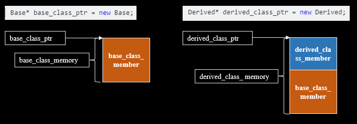
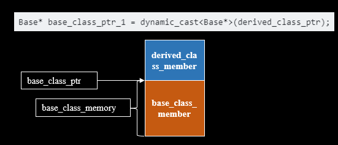
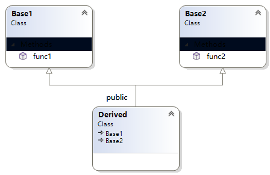

# 7.4 动态运行时识别RTTI

动态运行时识别，英文缩写`RTTI`，全称是`Runtime Type Identification`，是在运行时识别对象类型的机制。
RTTI的主要应用场景有两个

- 1、typeid
- 2、dynamic_cast

## 7.4.1 typeid

typeid用于在运行时获取对象的类型信息，由于c++是静态语言（即在编译时就可以确定变量的数据类型），因此对于一般类型可以直接得到他的类型信息

```cpp

void func(){ }

class Base { 
public:
	virtual void func1(){}
};

class Derived : public Base{
public:
	void func1() {}
	void func2(){}
};

// 获取值类型的基本信息 : int
int a = 10;
const std::type_info& a_info = typeid(a);
std::cout << a_info.name() << std::endl;

// 获取类类型的基本信息 : class Derived
Derived derived;
const std::type_info& derived_info = typeid(derived);
std::cout << derived_info.name() << std::endl;

// 获取值类型指针的基本信息 : int * __ptr64
int* b = new int(10);
const std::type_info& b_info = typeid(b);
std::cout << b_info.name() << std::endl;

// 获取类类型指针的基本信息 : class Derived * __ptr64
Derived* derivedptr = new Derived;
const std::type_info& derivedptr_info = typeid(derivedptr);
std::cout << derivedptr_info.name() << std::endl;

// 获取全局函数的基本信息 : void __cdecl(void)
const std::type_info& func_info = typeid(func);
std::cout << func_info.name() << std::endl;
```

而对于发生`向上转型且类中含有虚函数的基类指针`，就需要借助虚函数机制获取类型信息，为了通过对比来体现虚函数在使用`typeid`获取类型信息的作用，有以下代码

```cpp
class Base { 
public:
	virtual void func1(){}
};

class Derived : public Base{
public:
	void func1() {}
	void func2(){}
};

class Base1 {
public:
	void func1(){}
};

class Derived1 : public Base1
{
	void func1() {}
	void func2() {}
};

// 基类指针指向派生类对象
// 未使用虚函数的结果: class Base1
Base1* base1ptr = new Derived1;
const std::type_info& base1ptr_info = typeid(*base1ptr);
std::cout << base1ptr_info.name() << std::endl;

// 基类指针指向派生类对象
// 使用虚函数的结果: class Derived
Base* baseptr = new Derived;
const std::type_info& baseptr_info = typeid(*baseptr);
std::cout << baseptr_info.name() << std::endl;
```

通过查看`Derived`对象的内存布局可以看到虚函数表存储了`&Derived_meta`指针， 该指针指向了类的类型信息

```
class Derived   size(4):
        +---
 0      | +--- (base class Base)
 0      | | {vfptr}
        | +---
        +---

Derived::$vftable@:
        | &Derived_meta
        |  0
 0      | &Derived::func1

Derived::func1 this adjustor: 0
```

```
class Derived1  size(1):
        +---
 0      | +--- (base class Base1)
        | +---
        +---
```

使用typeid获取`向上转型且类中含有虚函数的基类指针`指向的类对象类型信息，主要有以下几步

- 在基类指针指向的派生类对象中找到派生类虚函数表指针`vfptr`
- 根据vfptr加上偏移量找到`&派生类名_meta`
- 通过地址`&派生类名_meta`找到存储的对象类型信息

## 7.4.2 dynamic_cast

`dynamic_cast`是除`static_cast`, `const_cast`和`reinterpret_case`之外的一个类型转换方式。<br/>它主要用在含有继承关系且基类有虚函数的类对象之间转换（运行期类型转换），在转换时，它能够检验具有继承关系的父子类型指针和引用的转换是否安全。如果转换是安全的返回转换成功的指针, 否则则返回空指针(nullptr)。

### 7.4.2.1 dynamic_cast转换规则

```cpp
Derived* derived_class_ptr = new Derived;
Base *base_class_ptr = dynamic_cast<Base *>(derived_class_ptr);
```

要想使上面语句中的dynamic_cast可以进行正确转换，分两种情况进行讨论
- 1、 静态转换
	- Base必须是Derived的基类

- 2、 动态转换
	- Base必须包含虚函数
	- Base必须是derived_class_ptr指向对象的对应类的基类

dynamic_cast怎么判断一个指针是否可以转为另一个指针的呢？
<br/>

对于一个基类`Base`和他的派生类`Derived`，由于派生类`Derived`继承了基类`Base`的所有成员函数，并且可能会有自己新增的成员函数，因此派生类指针`Derived*`和基类指针`Base*`的寻址空间示意图如下



因此使用基类指针`Base*`指向派生类对象`Derived`是合法的，使用dynamic_cast可以进行正确转换，反之使用派生类指针`Derived*`指向基类对象`Base`，由于基类对象空间不能满足派生类指针的内存要求，使用dynamics转换失败



### 7.4.2.2 dynamic_cast的原理

下面基于[dynamic_cast_test.cpp](../../../code/cpp_primer/ch_07_多态/04_运行时类型识别/dynamic_cast_test.cpp)中的继承结构来阐述dynamic_cast的功能




```cpp
	// 编译期类型转换
	Animal* a = new Animal; 
	Dog* dog = new Dog;

	// d -> a: 转换成功 
	Animal* a_1 = dynamic_cast<Animal*>(dog);
	std::cout << a_1 << std::endl;	// 0x000001C539A11960 

	// a -> d: 编译失败: the operand of a runtime dynamic_cast must have a polymorphic class type
	// Dog* dog_1 = dynamic_cast<Dog*>(a);
	// std::cout << dog_1 << std::endl;


	// 运行期类型转换
	Derived* d = new Derived;
	Base1* b1 = new Base1;
	Base2* b2 = new Base2;

	std::cout << d << std::endl;	// 0x000001E10C994880
	std::cout << b1 << std::endl;	// 0x000001E10C994C40
	std::cout << b2 << std::endl;	// 0x000001E10C994600
	
	// b1 -> b2: 转换失败 
	Base2* b2_1 = dynamic_cast<Base2*>(b1);
	std::cout << b2_1 << std::endl;	// 0x0000000000000000

	// b2 -> b1: 转换失败
	Base1* b1_1 = dynamic_cast<Base1*>(b2);
	std::cout << b1_1 << std::endl;	// 0x0000000000000000

	// b1 -> d: 转换失败
	Derived* d_1 = dynamic_cast<Derived*>(b1);
	std::cout << d_1 << std::endl;	// 0x0000000000000000

	// d -> b1: 转换成功
	Base1* b1_2 = dynamic_cast<Base1*>(d);
	std::cout << b1_2 << std::endl;	// 0x000001E10C994880

	// b2 -> d: 转换失败
	Derived* d_2 = dynamic_cast<Derived*>(b2);
	std::cout << d_2 << std::endl;	// 0x0000000000000000

	// d -> b2: 转换成功
	Base2* b2_2 = dynamic_cast<Base2*>(d);
	std::cout << b2_2 << std::endl;	// 0x000001E10C994888

	// d -> b2 -> b1
	Base1* b1_3 = dynamic_cast<Base1*>(b2_2);
	std::cout << b1_3 << std::endl;	// 0x000001E10C994880
```
