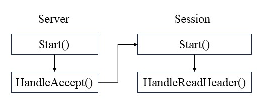

# 在对象中创建指向对象本身的shared_ptr ：shared_from_this 


## 使用场景：
当shared_ptr指针的引用计数为零时，智能指针所管理的资源将会被自动回收。
当出现以下场景时，会发生类方法被调用时，调用者已经被析构的情况。
具体过程如下

- 1、Server启动， 注册连接监听服务
- 2、新连接到达服务器时触发回调函数HandleAccept, 启动session
- 3、Session启动，注册监听读事件服务
- 4、消息到达服务器时，触发回调函数HandleReadHeader处理消息头部

在第1，2步都结束后, 由于函数都已经结束，Session对象实际已经被释放了，由于4是异步监听，新消息抵达服务器时， 再触发HandleReadHeader将会报错



```cpp
    class Server{
        void Start(){
            // 创建新session
            std::shared_ptr<CSession> new_session = std::make_shared<CSession>(ioc_, this);
            
            // 注册异步监听服务，当新连接到达，调用HandleAccept处理新连接
            acceptor_.async_accept(
                new_session->sock(), 
                std::bind(&CServer::HandleAccept, this, std::placeholders::_1, new_session)
            );
        }

        void HandleAccept(const boost::system::error_code &ec, std::shared_ptr<CSession> session)
        {
            // 调用Session::Start
            session->Start();
        }
    };

    Class Session{
    public:
        void Start()
        {
            // 监听读事件
            // 当消息到达服务器时，触发回调函数HandleReadHeader
            boost::asio::async_read(
                sock_, 
                boost::asio::buffer(recv_header_->data_, kMessageHeaderLength),
                std::bind(&CSession::HandleRead, this, std::placeholders::_1, std::placeholders::_2)
            );
        }

        void HandleReadHeader(const boost::system::error_code &ec, std::size_t bytes_transferred)
        {
            // 处理消息头部
        }
    };
```


## 使用enable_shared_from_this延长对象声明周期
为了解决上面的问题，我们需要聚焦HandleReadHeader这个函数，在调用HandleReadHeader时，session依然存活，当然在Session类外部创建一个数据结构用来管理session，保持session的引用计数至少为1，或者将Server中创建的session智能指针传入Session的Start方法和HandleReadHeader方法可以保证创建的session能存活到处理消息头部那一时刻。<br/>

使用enable_shared_from_this可以在对象方法中增加对象资源的引用计数。<br/>
 

```cpp
    class Server{
        void Start(){
            // 创建新session
            std::shared_ptr<CSession> new_session = std::make_shared<CSession>(ioc_, this);
            
            // 注册异步监听服务，当新连接到达，调用HandleAccept处理新连接
            acceptor_.async_accept(
                new_session->sock(), 
                std::bind(&CServer::HandleAccept, this, std::placeholders::_1, new_session)
            );
        }

        void HandleAccept(const boost::system::error_code &ec, std::shared_ptr<CSession> session)
        {
            // 调用Session::Start
            session->Start();
        }
    };

    Class Session:public std::enable_shared_from_this<Session>{
    public:
        void Start()
        {
            // 监听读事件
            // 当消息到达服务器时，触发回调函数HandleReadHeader
            boost::asio::async_read(
                sock_, 
                boost::asio::buffer(recv_header_->data_, kMessageHeaderLength),
                std::bind(&CSession::HandleRead, this, std::placeholders::_1, std::placeholders::_2, shared_from_this())
            );
        }

        void HandleReadHeader(const boost::system::error_code &ec, std::size_t bytes_transferred, std::shared_ptr<CSession> self_shared)
        {
            // 处理消息头部
        }
    };
```


## 一些注意事项
- 使用shared_from_this()需要保证外部至少有一个shared_ptr指向该对象
- 必须public继承enable_shared_from_this