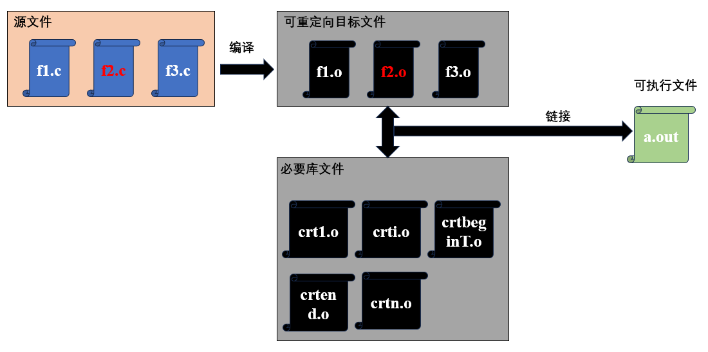
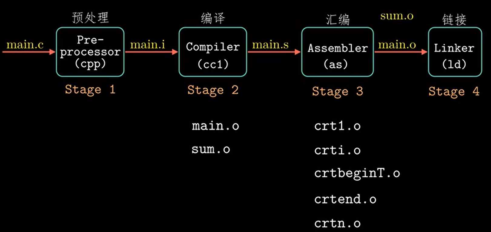

# ch07-01 链接(Linking)是什么

链接是将各种代码和数据收集并组合成一个文件的过程， 最终生成的文件可以被加载到内存中执行。<br/>

在大型项目中，常常按功能将代码放在许多编译单元中，当其中一个编译单元(f2.c)需要变更，只需要重新编译这个编译单元(f2.c)，其他编译单元不需要重新编译



## 7-01.1 为什么需要理解链接

- 1、构建大型项目时，经常出现缺少库文件或库文件版本不匹配的链接错误，解决这类文件需要了解链接器如何使用库文件
- 2、在编码时可能会出现难以发现的链接错误
- 3、理解链接过程可以帮助理解编程语言的作用域是怎么实现的，比如全局变量和局部变量的区别，static变量和函数的实际意义是什么？
- 4、理解链接可以帮助理解一些操作系统概念，比如程序加载和运行，虚拟内存和内存映射等
- 5、理解编译可以帮助更好的使用共享库

## 7-01.1 链接在编译过程中的位置和作用

编译过程


通过编译链接下面两个文件来拆解编译过程<br/>
[main.c](../../../code/csapp/ch07-链接Linking/01_链接是什么/main.c) 

```cpp
int sum(int *a, int n);
int array[2]={1,2};
int main(){
    int val = sum(array, 2);
    return val;
}
```

[sum.c](../../../code/csapp/ch07-链接Linking/01_链接是什么/sum.c)

```cpp
int sum(int *a, int n)
{
    int i, s = 0;
    for (int i = 0; i < n; ++i)
    {
        s += a[i];
    }
    return s;
}
```


```shell
# > 生成main.o
# Stage1 预编译: 执行预编译指令
# cpp : c preprocessor(c预处理器)
cpp main.c -o main.i
# gcc -E main.c -o main.i


# Stage2 汇编：将ascill码文件翻译为汇编文件
# cc: c compiler(c编译器)
cc -S main.i -o main.s
# gcc -S main.i -o main.s

# Stage3 编译：将汇编文件编译为二进制文件
# as: assembler(汇编器)
as main.s -o main.o

# > 生成sum.o
gcc -E sum.c -o sum.i
gcc -S sum.i -o sum.s
as sum.s -o sum.o


# > Stage4 链接：将可重定向目标文件(.o)和必要的系统文件组合起来生成可执行文件
ld -static -o prog main.o sum.o /usr/lib/x86_64-linux-gnu/crt1.o /usr/lib/x86_64-linux-gnu/crti.o /usr/lib/gcc/x86_64-linux-gnu/11/crtbeginT.o -L/usr/lib/gcc/x86_64-linux-gnu/11 -L/usr/lib --start-group -lgcc -lgcc_eh -lc --end-group /usr/lib/gcc/x86_64-linux-gnu/11/crtend.o /usr/lib/x86_64-linux-gnu/crtn.o
```


