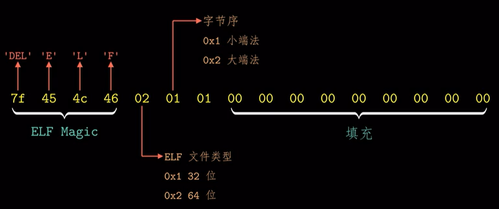
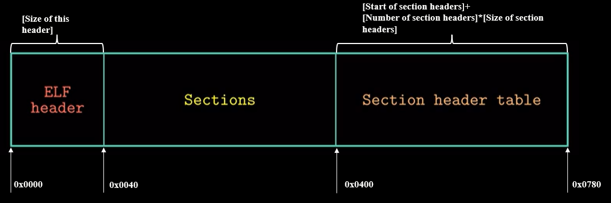
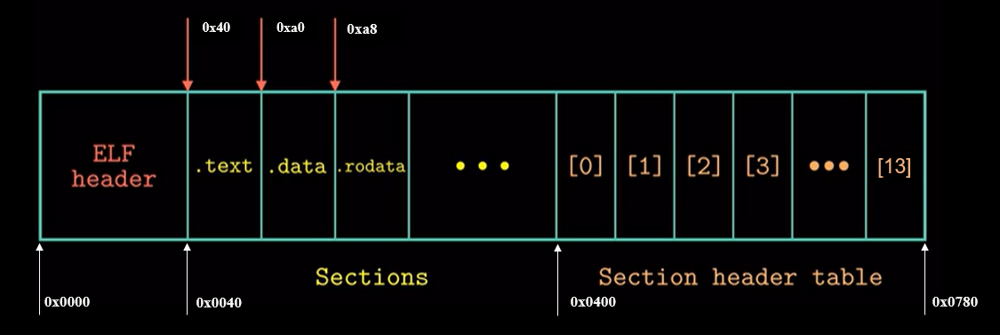

# ch07-02 可重定位目标文件

可重定位目标文件(Relocatable Ojbect Files): 是源文件(.c)经预处理，编译和汇编之后生成的(.o)文件

## 7-02.1 可重定位目标文件的具体内容

以 [main.c](../../../code/csapp/ch07-链接Linking/02_可重定位目标文件/main.c)为源文件，探索生成的可重定位目标文件的具体内容

```cpp
#include <stdio.h>

// 初始化的全局变量
int count = 10;
// 未初始化的全局变量
int value;
// 初始化为0的全局变量
int var = 0;

// 全局函数
void func(int sum)
{
    printf("sum is %d\n", sum);
}

// 全局函数
int main()
{
    // 初始化的局部静态变量
    static int a = 1;
    // 初始化为0的局部静态变量
    static int b = 0;
    // 局部变量
    int x = 1;
    func(a + b + x);
    return 0;
}
```

查看生成的可重定向文件字节数,得到结果是1920,说明文件`main.o`共有1920个字节

```shell
# > 将main.c编译为可重定向目标文件main.o
# gcc -c: 表示只进行编译和汇编，不执行链接
gcc -c main.c -o main.o

# > 统计main.o的字节数
# wc可以统计文件的字节数/字符数, 行数和单词数
# -c , --bytes, --chars: 表示统计文件的字节数
# -l , --lines: 表示统计文件的行数
# -w, --words: 表示统计文件的字数
wc -c main.o
```

### 7-02.1.1 可重定位文件的文件结构

每个可重定位文件都包含三个部分：`ELF header`，`Sections`和描述sections信息的表`Secontion header table`

> ELF(Executable and Linkable Format): 可执行可链接格式


### 7-02.1.2 ELF header的具体内容

使用下列命令查看`main.o`的`ELF header`信息

```shell
# > 查看elf header具体内容
readelf -h main.o > main.elfheader
```

`ELF header`具体内容如下

```main.elfheader
ELF Header:
  Magic:   7f 45 4c 46 02 01 01 00 00 00 00 00 00 00 00 00 
  Class:                             ELF64
  Data:                              2's complement, little endian
  Version:                           1 (current)
  OS/ABI:                            UNIX - System V
  ABI Version:                       0
  Type:                              REL (Relocatable file)
  Machine:                           Advanced Micro Devices X86-64
  Version:                           0x1
  Entry point address:               0x0
  Start of program headers:          0 (bytes into file)
  Start of section headers:          1024 (bytes into file)
  Flags:                             0x0
  Size of this header:               64 (bytes)
  Size of program headers:           0 (bytes)
  Number of program headers:         0
  Size of section headers:           64 (bytes)
  Number of section headers:         14
  Section header string table index: 13
```

Magic行数字的含义，其中ELF Magic是加载ELF文件时用来验证文件是不是ELF文件



根据`ELF header`的信息可以推断出以下信息，可以看出整个文件总共有1920(0x0780)个字节，与命令`wc -c main.o`结果一致



### 7-02.1.3 Section headers和常用Sections的具体内容

使用下列命令查看`main.o`的`section headers`

```shell
# > 打印sections信息
readelf -S main.o > main.elfsectionheaders
```

`section headers`具体内容如下

```main.elfsectionheaders
There are 14 section headers, starting at offset 0x400:

Section Headers:
  [Nr] Name              Type             Address           Offset
       Size              EntSize          Flags  Link  Info  Align
  [ 0]                   NULL             0000000000000000  00000000
       0000000000000000  0000000000000000           0     0     0
  [ 1] .text             PROGBITS         0000000000000000  00000040
       000000000000005f  0000000000000000  AX       0     0     1
  [ 2] .rela.text        RELA             0000000000000000  000002e0
       0000000000000078  0000000000000018   I      11     1     8
  [ 3] .data             PROGBITS         0000000000000000  000000a0
       0000000000000008  0000000000000000  WA       0     0     4
  [ 4] .bss              NOBITS           0000000000000000  000000a8
       000000000000000c  0000000000000000  WA       0     0     4
  [ 5] .rodata           PROGBITS         0000000000000000  000000a8
       000000000000000b  0000000000000000   A       0     0     1
  [ 6] .comment          PROGBITS         0000000000000000  000000b3
       000000000000002c  0000000000000001  MS       0     0     1
  [ 7] .note.GNU-stack   PROGBITS         0000000000000000  000000df
       0000000000000000  0000000000000000           0     0     1
  [ 8] .note.gnu.pr[...] NOTE             0000000000000000  000000e0
       0000000000000020  0000000000000000   A       0     0     8
  [ 9] .eh_frame         PROGBITS         0000000000000000  00000100
       0000000000000058  0000000000000000   A       0     0     8
  [10] .rela.eh_frame    RELA             0000000000000000  00000358
       0000000000000030  0000000000000018   I      11     9     8
  [11] .symtab           SYMTAB           0000000000000000  00000158
       0000000000000150  0000000000000018          12     8     8
  [12] .strtab           STRTAB           0000000000000000  000002a8
       0000000000000031  0000000000000000           0     0     1
  [13] .shstrtab         STRTAB           0000000000000000  00000388
       0000000000000074  0000000000000000           0     0     1
Key to Flags:
  W (write), A (alloc), X (execute), M (merge), S (strings), I (info),
  L (link order), O (extra OS processing required), G (group), T (TLS),
  C (compressed), x (unknown), o (OS specific), E (exclude),
  D (mbind), l (large), p (processor specific)
```

通过`section headers`的信息可知`sections`一共有13个`section`



对`main.o`进行反汇编可以得到各`section`的信息

- section `.text`的起始地址是0x0040，位于`sections`的第一位，用来存放编译成二进制的代码，大小是0x005f

```main.s
Contents of section .text:
 0000 f30f1efa 554889e5 4883ec10 897dfc8b  ....UH..H....}..
 0010 45fc89c6 488d0500 00000048 89c7b800  E...H......H....
 0020 000000e8 00000000 90c9c3f3 0f1efa55  ...............U
 0030 4889e548 83ec10c7 45fc0100 00008b15  H..H....E.......
 0040 00000000 8b050000 000001c2 8b45fc01  .............E..
 0050 d089c7e8 00000000 b8000000 00c9c3    ............... 
```

- section `.data`的起始地址0x00a0, 位于`sections`的第二位，用来存放已经初始化的全局变量和静态变量的值，大小是0x0008

```main.s
Contents of section .data:
 0000 0a000000 01000000                    ........        
```

- section `.bss`的起始地址0x00a8, 用来存放未初始化和初始化为0的全局变量和静态变量, 特别的是`bss`并不真的存储数据，他只是一个占位符

- section `.rodata`的起始地址0x00a8, 位于`sections`的第二位, 用来存放只读数据，比如printf的格式串就存在这个区域

```main.s
Contents of section .rodata:
 0000 73756d20 69732025 640a00             sum is %d..  
```


### 7-02.1.4 其余Section的介绍

|Section|Introduction|
|:----|:----|
|.comment|存放编译器的版本信息|
|.symtab|符号表(Symbol table)|
|.rela.text|重定位表(Relocation table)|
|.debug|调试信息|
|.line|原始c代码行号和`.text` section中机器指令之间的映射|
|.strtab|字符串表(String table)|

> 具体段内容参照反汇编文件[main.s](../../../code/csapp/ch07-链接Linking/02_可重定位目标文件/main.s)