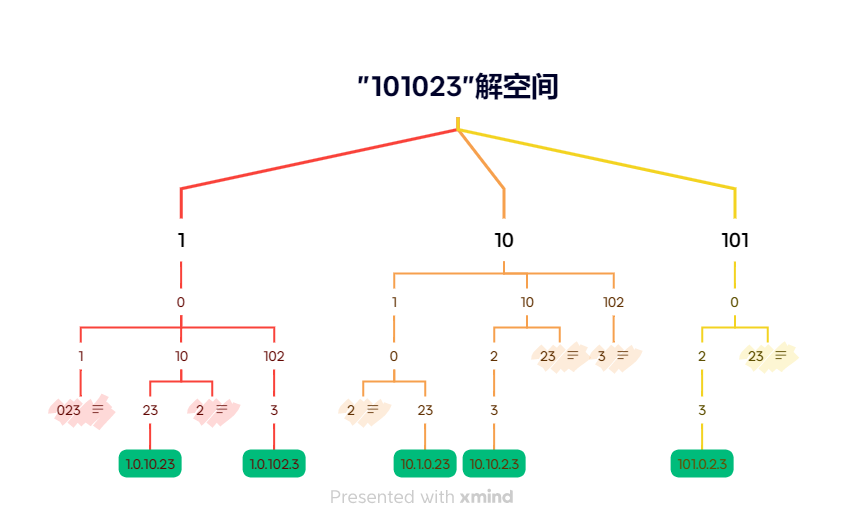

## 1、实例：字符串"101023"的所有可能ip的解空间

## 2、回溯法实现

总段数: kIPSegmentCount = 4;

### 1）深搜过程 dfs(s, segmentStart, segmentId)
从字符串s的segmentStart位置开始搜索第segmentId段的值，符合剪枝条件则进行回溯
> ① dfs(s, segmentStart + 1, segmentId + 1) 
>   当s[segmentStart]的值不为0时 
    当前段设为 
     s.substr(segmentStart, 2), dfs(s, segmentStart + 2, segmentId + 1) 
     s.substr(segmentStart, 3) (<= 255)，dfs(s, segmentStart + 3, segmentId + 1)

### 2) 剪枝条件
#### ① 位于第i段时，剩余的字符数restCharCount不满足 
   kIPSegmentCount <= restCharCount <= kIPSegmentCount * 3

#### 

